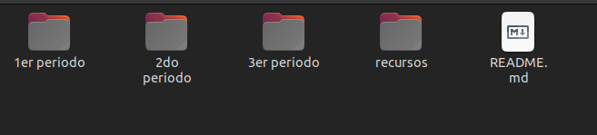
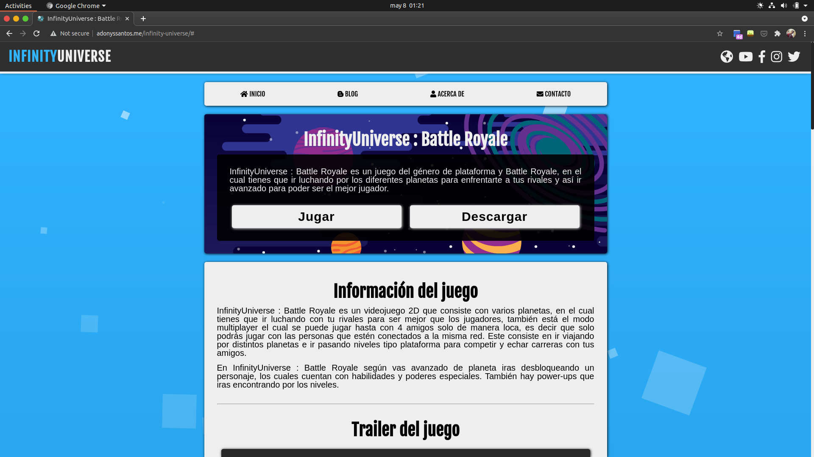
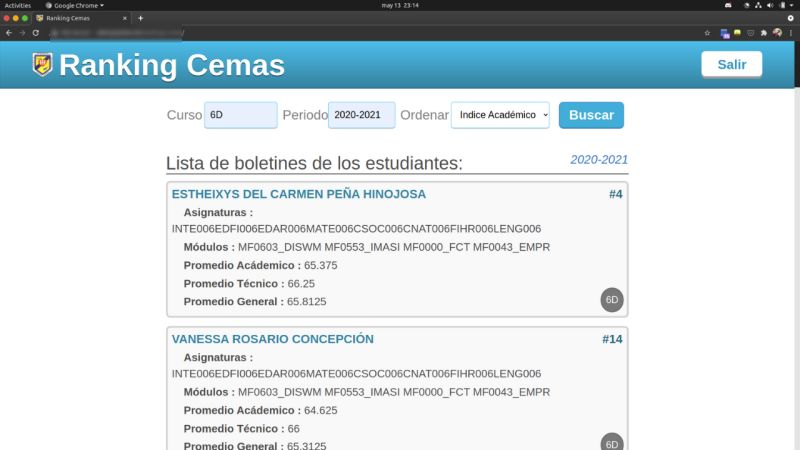

# Resumen Informática CEMAS

Este es un resumen de todo lo que aprendí en los 3 años estudiando en el técnico de **Desarrollo y Administración de Aplicaciones Informáticas** en el **Centro Educativo Manuel Acevedo Serrano (Fé y Alegria)**.

_Cabe resaltar que este es un resumen generalizado de la mayoria de los temas, quizas se me paso algún que otro tema y no quise detallarlo._

---

He organizado cada tema por periodo escolar (esto solo incluye la materias de informática). En total tenemos 3 carpetas, es decir 3 años.

En la carpeta `recursos` hay algunos materiales (videos, imagenes, documentos, cursos, etc) que pueden serte util si te interesa indagar sobre estos temas.

## 1er Periodo

En el primer año conocmos los conceptos básicos del desarrollo web, ofimática, la lógica de la computadora y base de datos.

- HTML y CSS
- Diagramas de flujo
- Acceso y MySQL

Me gustó mucho porque a finales de año había terminado mi primer sitio web funcional. También conocí conceptos de negocio, como el análisis FODA, plan de negocio, etc.

_Así quedo mi primera página web._ 😁

## 2do Periodo

En el segundo año aprendí el funcionamiento de la computadora, programación y bases de datos.

- Lenguaje binario
- Historia de la computadora
- Bases de datos SQL y NoSQL
- Los 5 pilares de la programación
- Editores de código e IDE
- JavaScript

Este año nos enfcamos en realizar pequeños proyectos con _JavaScript_ para desarrollar la lógica, aquí te dejo el link algunos de ellos: [https://github.com/TeamSinNombre](https://github.com/TeamSinNombre).

## 3er Periodo

En el último año (2020 - 2021) nos vemos obligados a tomar clases desde casa. La ruta de aprendizaje de este año fue la siguiente:

- Uso del terminal.
- Control de versiones (Git y GitHub)
- Editor de código VIM.
- Node.js y React.js
- TypeScript
- Firebase
- Patrones de diseño

### Los proyectos que hicmos fueron:

#### Un chat en tiempo real

Este fue no de los proyectos que teniamos que desarrollar en la materia de **Formacion Laboral** en conjunto a mis compañeros. Hicimos un chat utilizando React para el _Frontend_ y Firebase para el _Backend_.

_Más adelante te explicare esos terminos (Backend y Frontend)._

#### Una aplicación para ordenar las notas de los alumnos del CEMAS (Ranking cemas)

